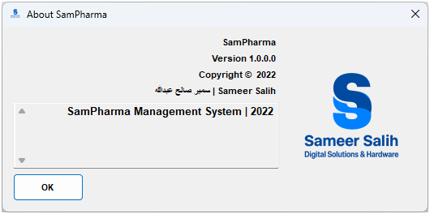

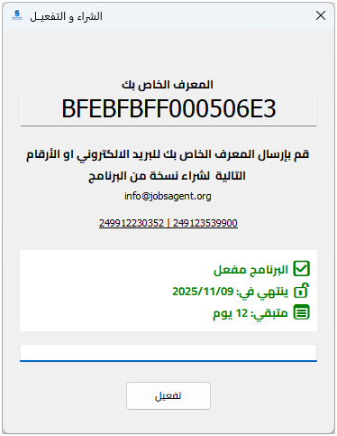

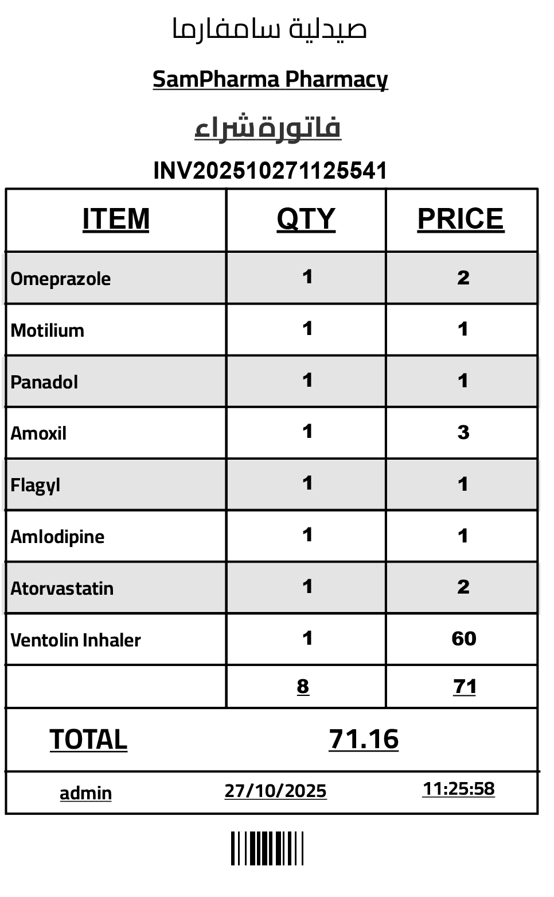

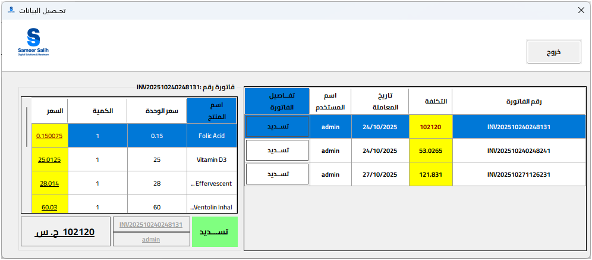

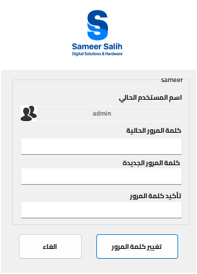

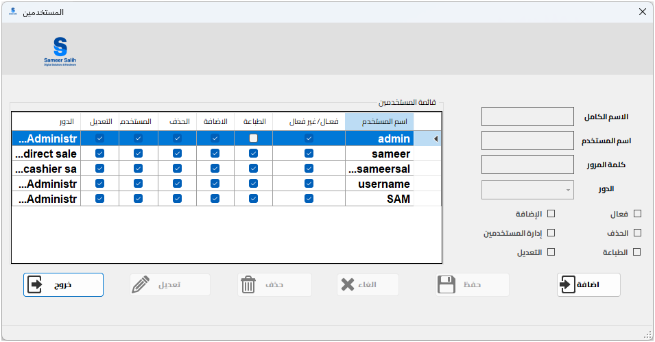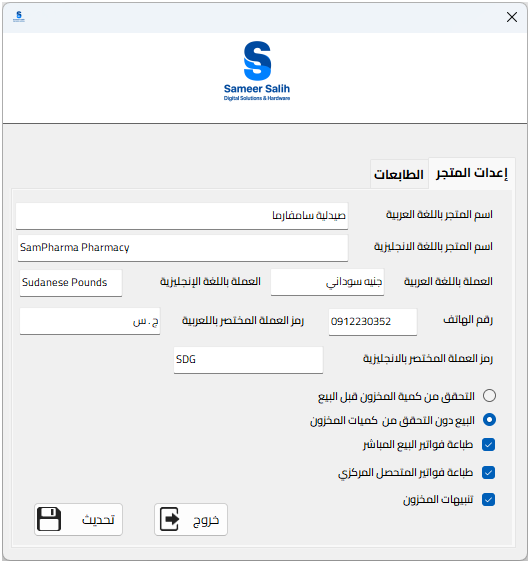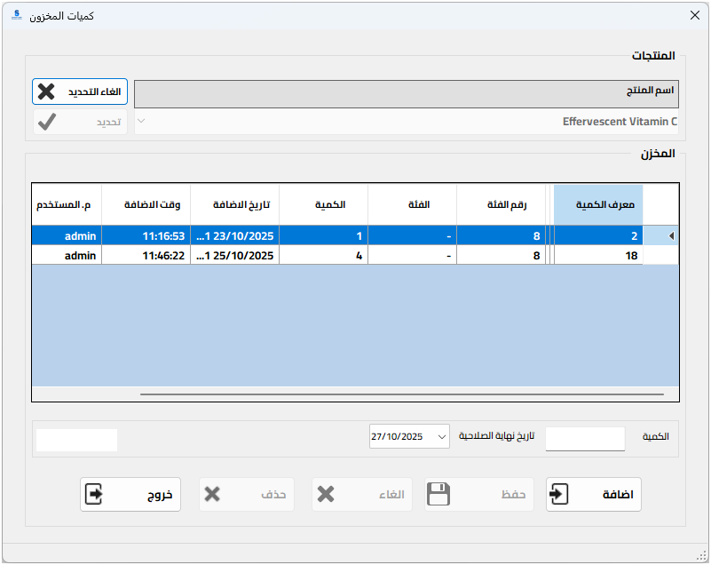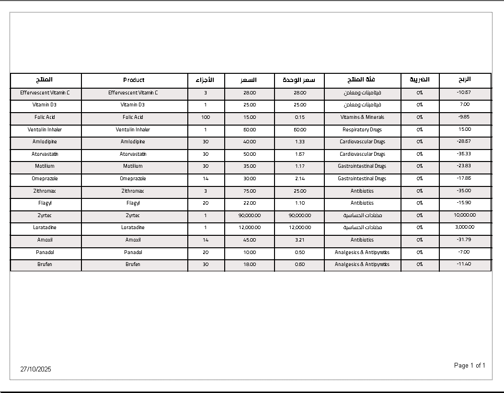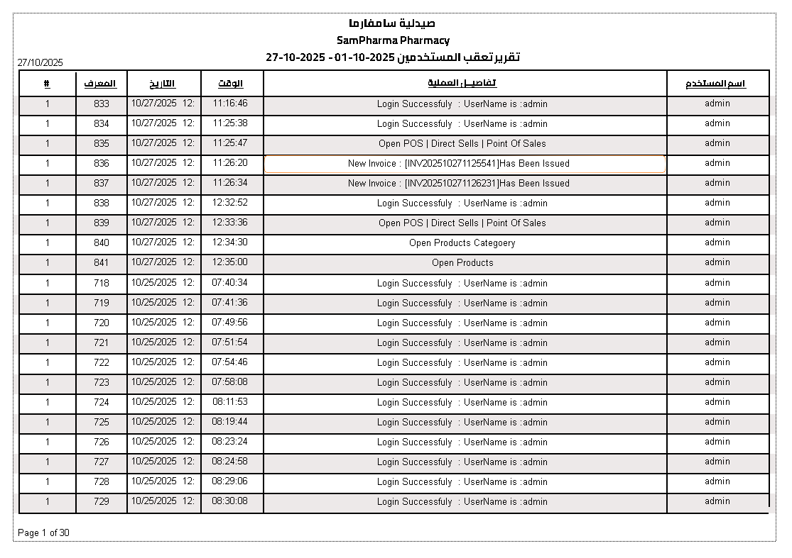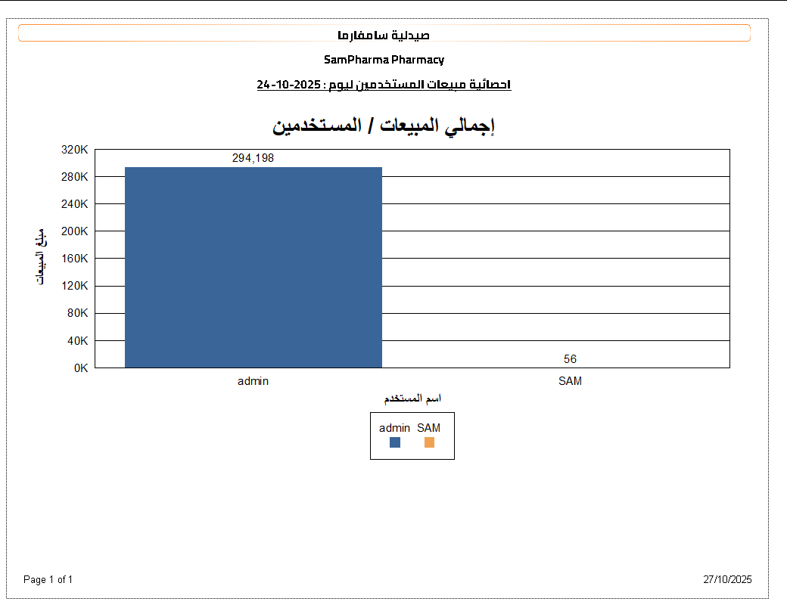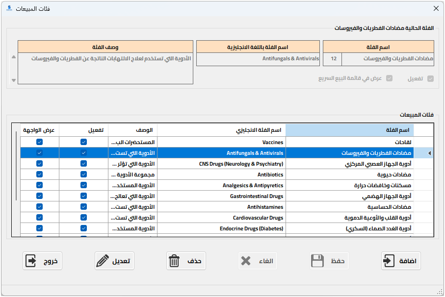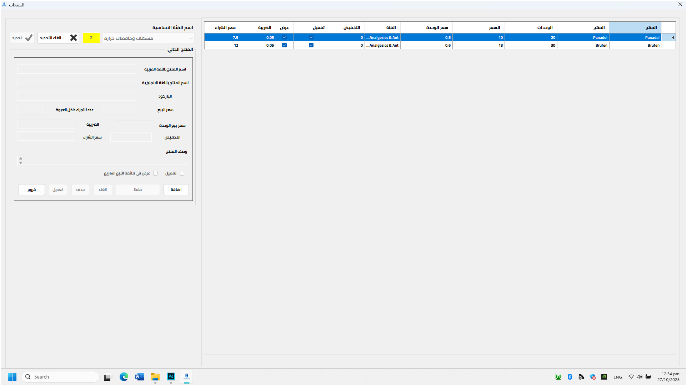
🔥 ##SSPOS 📌 The Comprehensive Point of Sale and Cashier System for Your Business! 🔥

✅ Fast and Efficient Sales Management 📌 Easy-to-use cashier interface for quick transaction completion. 
📌 Supports barcode reader, receipt printer, and cash drawer. 
📌 Ability to suspend current invoice and open a new one. 
📌 Multiple payment methods (Cash, Card, Credit).

✅ Smart Inventory Management 
📌 Accurate real-time inventory tracking. 
📌 Automated low-stock alerts to prevent product shortages. 
📌 Centralized inventory management for multiple branches.

✅ Business Reporting and Analytics 
📌 Detailed and real-time reports on sales, profits, and product performance. 
📌 Monitoring of cash register balance, and daily cash/credit sales. 
📌 Data to help you make informed decisions for business growth.

✅ Customer and Employee Management 
📌 Build a strong customer database and track purchase history. 
📌 Ability to implement customized loyalty programs and discounts. 
📌 Efficiently define employee permissions and manage work shifts.

✅ High Compatibility and Flexibility 
📌 Cloud-based system allows you to access and manage your business anytime, anywhere. 
📌 Works across various devices and operating systems.
